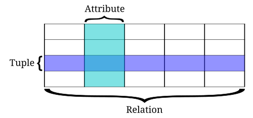

## Introduction

Tables are grouped into databases, and a collection of databases managed by a single PostgreSQL server instance constitutes a database cluster.

## Setting up 

*Database Cluster* - It is a Postgres Database Instance running in a server listening in particular PORT, it has a master storage folder where all the databases live
*Database* - isloated logical container inside cluster, meant for specific application or project 
*Schema* - a virtual folder or namespace inside a single database used to group related tables together , 

Minimal Postgres server setup 

1. Pull postgres:16 image
2. Create container
nerdctl run --name wa-postgres `
  -e POSTGRES_USER=postgres `
  -e POSTGRES_PASSWORD=postgres `
  -e POSTGRES_DB=postgres `
  -e TZ=Asia/Kolkata `
  -e PGTZ=Asia/Kolkata `
  -p 5435:5432 `
  -v "D:\docker-volumes:/var/lib/postgresql/data" `
  postgres:16

3. change ~/.psqlrc
4. change postgresql.conf file
5. \dt cd.* -> to list the schemas

## Relational Model

A relation consits of a heading and a body. heading consists of set of attributes called name and data type (domain), 

body is a set of tuples, and it has collection of n values , n is the relation's degree and each value in the tuple consists of unnique attribute , No of tuples in this set is the relation's *cardinality*

a Table or relation sometimes called as relvars (relation variables)

- Customer (Customer ID, Name)
- Order (Order ID, Customer ID, Invoice ID, Date)
- Invoice (Invoice ID, Customer ID, Order ID, Status)

*Attributes* are represented as *columns*
*tuples* as rows*

